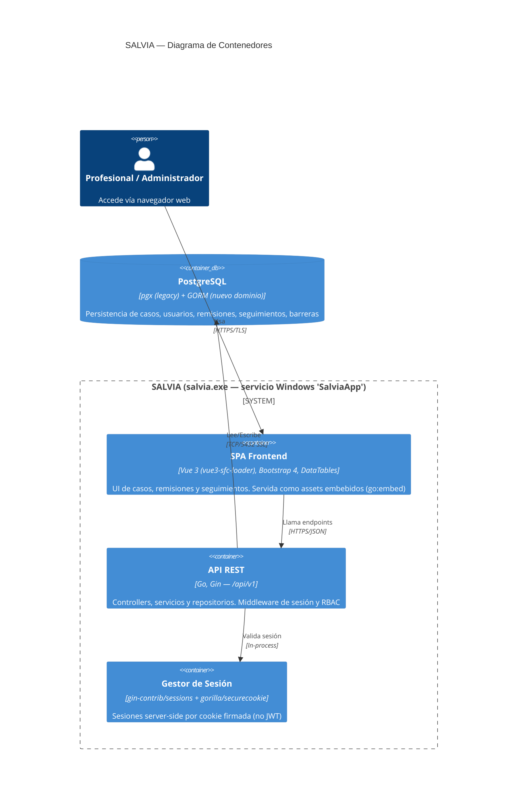

# Diagrama de Contenedores (C4 — Level 2)

## Descripción

SALVIA se despliega como un **único binario** (`salvia.exe`) que embebe la SPA de Vue y expone la API REST. Este diagrama muestra sus componentes internos y su relación con la base de datos.

## Diagrama

## Contenedores

| Contenedor | Tecnología | Responsabilidad | Puerto |
| :--- | :--- | :--- | :---: |
| SPA Frontend | Vue 3 + `vue3-sfc-loader` + Bootstrap 4 / DataTables | UI, componentes, consumo de API. Sin paso de build (SFC cargadas en runtime) | Servida por el binario |
| API REST | Go 1.24 + Gin | Routing `/api/v1`, controllers, servicios, repositorios | TLS (certs) o `PORT` env |
| Gestor de Sesión | gin-contrib/sessions + gorilla/securecookie | Autenticación por sesión server-side (cookie firmada) | In-process |
| PostgreSQL | pgx v4/v5 + GORM (`driver/postgres`) | Persistencia relacional; migraciones vía GORM AutoMigrate + SQL en `src/migrations/` | 5432 |

## Comunicación entre Contenedores

| Origen → Destino | Protocolo | Autenticación |
| :--- | :--- | :--- |
| Navegador → SPA/API | HTTPS/TLS (`certs/salvia.crt`) | Cookie de sesión (HttpOnly, firmada) |
| API → PostgreSQL | TCP 5432 con `sslmode=require` | Connection string desde `config/db_config.json` |

> [!NOTE]
> El acceso a datos convive en dos capas: consultas directas con **pgx** (código legacy bajo `security/dao`, usuario `salvia_legacy`) y **GORM** para el dominio nuevo (`internal/repository`, `salvia/`, usuario `salvia_gorm`). Ver [ADR-001](/.knowledge/1-architecture/adrs/adr-001-stack-go-gin-vue-postgres.md).

> [!WARNING]
> El frontend Vue va **embebido en el binario** (`go:embed frontend/*`): cualquier cambio de UI requiere recompilar y redesplegar `salvia.exe`. No hay servidor de assets independiente.
