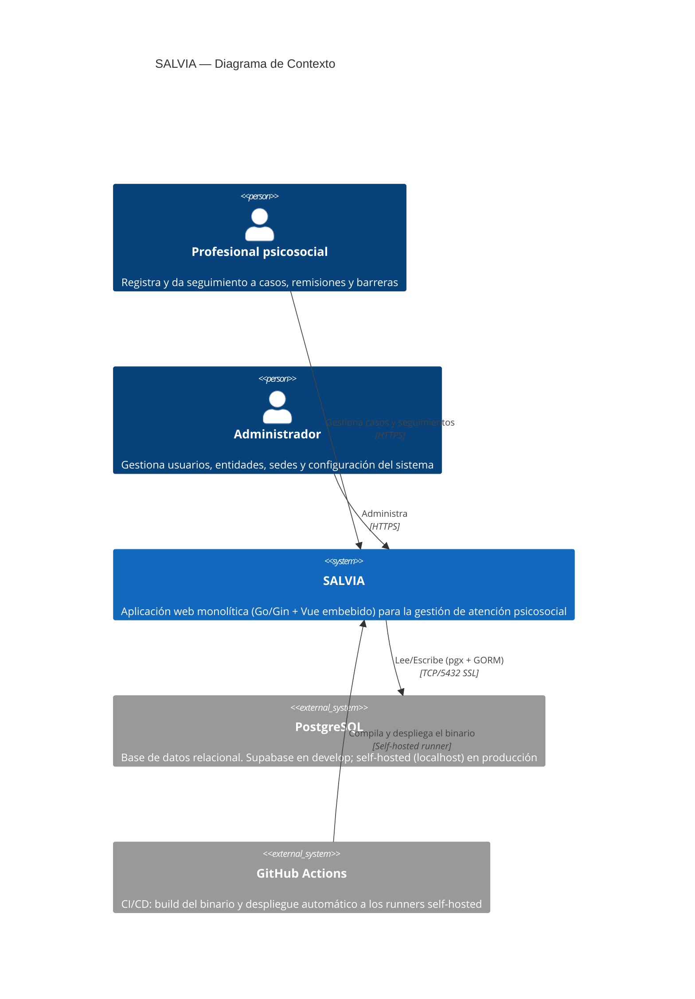

# Diagrama de Contexto del Sistema (C4 — Level 1)

## Descripción

SALVIA es un sistema de **gestión y atención psicosocial**: registra casos, remisiones, seguimientos, barreras y duplas de atención. Este diagrama muestra quién interactúa con el sistema y con qué sistemas externos se integra.

## Diagrama

## Actores

| Actor | Descripción | Autenticación |
| :--- | :--- | :--- |
| Profesional psicosocial | Usuario operativo que gestiona casos, remisiones, seguimientos y barreras | Usuario/contraseña + sesión server-side |
| Administrador | Gestiona usuarios, entidades/sedes, roles y configuración | Usuario/contraseña + sesión server-side |

> [!NOTE]
> El detalle de roles y permisos por recurso es una decisión de negocio pendiente de documentar en la [Matriz RBAC](/.knowledge/6-security/rbac-matrix.md).

## Sistemas Externos

| Sistema | Propósito | Protocolo | Notas |
| :--- | :--- | :--- | :--- |
| PostgreSQL | Persistencia principal | TCP 5432 (SSL) | Supabase (pooler) en `develop`; PostgreSQL local en `production` |
| GitHub Actions | Build y despliegue automático | Self-hosted runners (Windows) | Credenciales de BD inyectadas desde GitHub Secrets en el deploy |

## Fronteras del Sistema

> [!IMPORTANT]
> SALVIA es un **monolito auto-contenido**: un único binario Go (`salvia.exe`) sirve tanto la SPA de Vue (embebida vía `go:embed`) como la API REST bajo `/api/v1`. No hay microservicios ni gateway separado. El detalle técnico está en el [Diagrama de Contenedores](/.knowledge/1-architecture/container-diagram.md).
