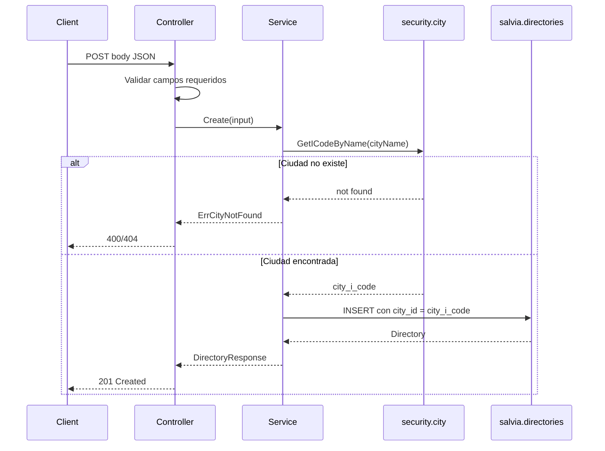

# Endpoints `directories`

Contrato HTTP para **subir** directorios (alcance inmediato) y **consultarlos** desde Flutter (alcance siguiente, documentado aquí para cerrar el flujo).

Patrón de referencia: [`LocationController`](../../src/salvia/controller/location_controller.go) y registro en `/api/v1` desde [`main.go`](../../src/main.go).

---

## Base URL

```
/api/v1/directories
```

---

## POST — Crear directorios en lote

Registra múltiples directorios en una sola solicitud. Acepta un **array JSON** directo (no un objeto wrapper).

### Request

```
POST /api/v1/directories/bulk
Content-Type: application/json
```

**Body:**

```json
[
  {
    "cityName": "Bogotá",
    "name": "Fiscalía Seccional Bogotá",
    "address": "Av. El Dorado No. 58-90, Edificio Fiscalía",
    "phone": "601-5701000",
    "email": "fiscalia.bogota@fiscalia.gov.co",
    "openingHours": "Lunes a Viernes 8:00 AM - 5:00 PM",
    "type": "FI"
  },
  {
    "cityName": "Medellín",
    "name": "Fiscalía Seccional Medellín",
    "address": "Av. El Dorado No. 58-90, Edificio Fiscalía",
    "phone": "601-5701000",
    "email": "fiscalia.medellin@fiscalia.gov.co",
    "openingHours": "Lunes a Viernes 8:00 AM - 5:00 PM",
    "type": "FI"
  }
]
```

| Regla | Detalle |
|---|---|
| Formato | Array JSON con 1–500 objetos |
| Campos por ítem | Igual que `POST /directories` |
| Ciudad | Misma resolución flexible (`Bogota` → `BOGOTÁ D.C.`) |
| Errores parciales | Los ítems válidos se guardan; los fallidos se reportan en `errors[]` |

### Respuesta

**201 Created** — al menos un directorio guardado

```json
{
  "total": 3,
  "created": 2,
  "failed": 1,
  "items": [
    {
      "id": "uuid-1",
      "cityId": "uuid-ciudad-bogota",
      "cityName": "BOGOTÁ D.C.",
      "name": "Fiscalía Seccional Bogotá",
      "type": "FI",
      "typeLabel": "Fiscalías"
    }
  ],
  "errors": [
    {
      "index": 2,
      "cityName": "Ciudad Inexistente",
      "name": "Fiscalía Seccional X",
      "error": "location: ciudad no encontrada: Ciudad Inexistente"
    }
  ]
}
```

**400 Bad Request** — array vacío, más de 500 ítems, o ningún directorio pudo guardarse

---

## POST — Crear directorio

Registra un nuevo directorio. Resuelve la ciudad por nombre antes de persistir.

### Request

```
POST /api/v1/directories
Content-Type: application/json
```

**Body:**

```json
{
  "cityName": "Bogotá D.C.",
  "name": "Fiscalía Seccional Bogotá",
  "address": "Av. El Dorado No. 58-90, Edificio Fiscalía",
  "phone": "601-5701000",
  "email": "fiscalia.bogota@fiscalia.gov.co",
  "openingHours": "Lunes a Viernes 8:00 AM - 5:00 PM",
  "type": "FI"
}
```

**Códigos `type` válidos:**

| Código | Etiqueta |
|---|---|
| `FI` | Fiscalías |
| `CF` | Comisarías de familia |
| `RU` | Red de Urgencias |
| `LE` | Líneas de Emergencia |

### Flujo interno



### Respuestas

**201 Created**

```json
{
  "id": "a1b2c3d4-e5f6-7890-abcd-ef1234567890",
  "cityId": "uuid-de-ciudad",
  "cityName": "Bogotá D.C.",
  "name": "Fiscalía Seccional Bogotá",
  "address": "Av. El Dorado No. 58-90, Edificio Fiscalía",
  "phone": "601-5701000",
  "email": "fiscalia.bogota@fiscalia.gov.co",
  "openingHours": "Lunes a Viernes 8:00 AM - 5:00 PM",
  "type": "FI",
  "creationDate": "2026-06-16T10:00:00Z",
  "updateDate": "2026-06-16T10:00:00Z"
}
```

**400 Bad Request** — body inválido o campos faltantes

```json
{ "error": "campos requeridos: cityName, name, address, type" }
```

**404 Not Found** — ciudad inexistente

```json
{ "error": "ciudad no encontrada: Bogotá D.C." }
```

**409 Conflict** — opcional, si se define regla de unicidad

```json
{ "error": "ya existe un directorio con ese nombre en la ciudad" }
```

**500 Internal Server Error**

```json
{ "error": "error interno" }
```

### Validaciones

| Regla | Detalle |
|---|---|
| `cityName` | Trim; búsqueda flexible en `security.city.city_name`: ignora mayúsculas, tildes y puntuación; elige la mejor coincidencia (ej. `"Bogota"` → `"BOGOTÁ D.C."`) |
| `name`, `address`, `type` | Requeridos, no vacíos |
| `phone`, `email`, `openingHours` | Opcionales según negocio; si vienen, validar longitud |
| `email` | Formato email básico |
| `type` | Exactamente 2 caracteres; debe ser uno de: `FI`, `CF`, `RU`, `LE` |

### Autenticación (pendiente)

| Opción | Comentario |
|---|---|
| Sesión + permiso `set_directory` | Consistente con facades legacy de Salvia |
| Solo rol `ad` | Carga administrativa de catálogo |
| `X-Security-Key` | Útil para scripts de seed masivo |

---

## GET — Listar directorios

Endpoint para la app Flutter. **`type` es obligatorio**; `cityName` es opcional para filtrar por municipio/ciudad.

### Request

Carga inicial (todos los directorios del tipo):

```
GET /api/v1/directories?type=RU&limit=100
```

Filtrado por ciudad:

```
GET /api/v1/directories?type=RU&cityName=Medellín
```

| Query param | Obligatorio | Descripción |
|---|---|---|
| `type` | Sí | Código de tipo: `FI`, `CF`, `RU`, `LE` |
| `cityName` | No | Filtra por ciudad/municipio (match flexible de tildes y mayúsculas) |
| `page` | No | Paginación, default `0` |
| `limit` | No | Tamaño de página, default `20` |

### Flujo interno

1. Validar `type`.
2. Si viene `cityName`, resolver → `city_i_code`.
3. `SELECT * FROM salvia.directories WHERE type = :type` (+ `city_id` si aplica).
4. Enriquecer cada ítem con `cityName` desde `security.city`.
5. Orden: `name ASC`.

### Respuesta

**200 OK** — carga inicial por tipo

```json
{
  "type": "RU",
  "typeLabel": "Red de Urgencias",
  "total": 120,
  "items": [
    {
      "id": "a1b2c3d4-e5f6-7890-abcd-ef1234567890",
      "cityId": "uuid-ciudad-medellin",
      "cityName": "MEDELLÍN",
      "name": "Hospital General de Medellín",
      "address": "Cra 48 #32-102",
      "phone": "6044440120",
      "type": "RU",
      "typeLabel": "Red de Urgencias"
    }
  ]
}
```

**200 OK** — filtrado por ciudad

```json
{
  "cityName": "MEDELLÍN",
  "type": "RU",
  "typeLabel": "Red de Urgencias",
  "total": 4,
  "items": [ "..."]
}
```

**400 Bad Request** — falta `type` o tipo inválido

```json
{ "error": "parámetro 'type' requerido" }
```

**404 Not Found** — ciudad inexistente (cuando se envía `cityName`)

```json
{ "error": "location: ciudad no encontrada: ..." }
```

### Ciudades por departamento (filtros UI)

```
GET /api/v1/locations/departments
GET /api/v1/locations/cities?department_id=5
```

**Respuesta ciudades filtradas:**

```json
[
  { "label": "MEDELLÍN", "value": "1", "departmentId": 5 },
  { "label": "ABRIAQUÍ", "value": "2", "departmentId": 5 }
]
```

Sin `department_id`, devuelve todas las ciudades (comportamiento anterior).

### Uso en Flutter (referencia)

```dart
// 1. Carga inicial al entrar a Red de Urgencias
GET /api/v1/directories?type=RU&limit=200

// 2. Dropdown departamento
GET /api/v1/locations/departments

// 3. Dropdown municipio según departamento seleccionado
GET /api/v1/locations/cities?department_id=5

// 4. Filtrar directorios al elegir municipio
GET /api/v1/directories?type=RU&cityName=MEDELLÍN
```

---

## GET — Obtener directorio por ID (opcional)

```
GET /api/v1/directories/:id
```

Útil para detalle o edición. No requerido para el listado inicial de Flutter.

**200 OK** — mismo shape que un ítem de la lista.  
**404 Not Found** — `{ "error": "directorio no encontrado" }`

---

## PUT / DELETE (fuera de alcance inicial)

| Método | Ruta | Uso |
|---|---|---|
| `PUT` | `/api/v1/directories/:id` | Actualizar directorio existente |
| `DELETE` | `/api/v1/directories/:id` | Eliminar del catálogo |

Documentar e implementar cuando exista pantalla de administración web.

---

## Capas backend (plan de implementación)

| Capa | Archivo propuesto | Responsabilidad |
|---|---|---|
| Model | `src/internal/models/directory.go` | Struct GORM + `TableName()` |
| Repository | `src/internal/repository/directory_repository.go` | CRUD + `FindByCityICode` |
| Repository (ciudad) | Extender `location_repository.go` o método en directory repo | `GetCityICodeByName(ctx, name)` |
| Service | `src/salvia/service/directory_service.go` | Resolver ciudad, validar, orquestar |
| Controller | `src/salvia/controller/directory_controller.go` | HTTP handlers + `RegisterRoutes` |
| Wiring | `src/main.go` | AutoMigrate, DI, `directoryCtrl.RegisterRoutes(api)` |

### Rutas registradas (objetivo)

```go
func (c *DirectoryController) RegisterRoutes(rg *gin.RouterGroup) {
    dirs := rg.Group("/directories")
    dirs.POST("", c.Create)
    dirs.GET("", c.List)
    dirs.GET("/:id", c.GetByID)
}
```

---

## Carga masiva (consideración)

Para poblar el catálogo inicial puede usarse:

1. **Script SQL/seed** con `city_i_code` ya resuelto.
2. **Colección Postman** contra `POST /api/v1/directories` con `cityName` legible.
3. **Endpoint batch:** `POST /api/v1/directories/bulk` — implementado (máx. 500 por solicitud).

Ejemplo de fila seed (con `city_i_code` conocido):

```sql
INSERT INTO salvia.directories
  (city_id, name, address, phone, email, opening_hours, type)
VALUES
  ('<city_i_code_bogota>', 'Fiscalía Seccional Bogotá',
   'Av. El Dorado No. 58-90, Edificio Fiscalía',
   '601-5701000', 'fiscalia.bogota@fiscalia.gov.co',
   'Lunes a Viernes 8:00 AM - 5:00 PM', 'FI');
```

---

## Checklist de aprobación

- [ ] Longitudes de columnas confirmadas
- [ ] Catálogo `type` validado con negocio
- [x] Estrategia de match de `cityName` (normalización + mejor score en `FindBestCityMatchByName`)
- [ ] Autenticación de `POST` y `GET`
- [x] `GET` implementado junto con `POST`
- [x] PK: `uuid` (`varchar(36)`)
