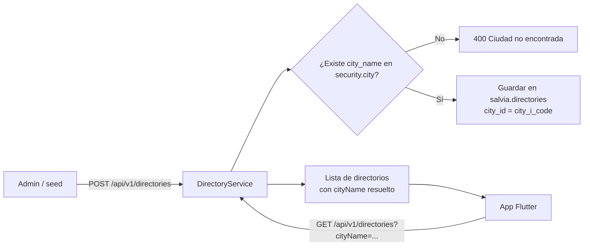

# Directorios — Índice de planeación

Planeación del módulo **Directorios**: catálogo de entidades de contacto (fiscalías, comisarías, líneas de atención, etc.) que la app Flutter muestra al usuario según la ciudad seleccionada.

> **Estado:** modelo implementado (`src/internal/models/directory.go`). Endpoints pendientes.

---

## Propósito

Permitir **cargar directorios** desde el backend (panel administrativo o script de seed) y **consultarlos desde la app Flutter**, filtrados por ciudad. Cada registro representa una tarjeta como la del mockup: nombre, ciudad, dirección, horario, correo y teléfono con acción de llamada.

---

## Archivos de esta carpeta

| Archivo | Descripción |
|---|---|
| [`directories-model.md`](directories-model.md) | Definición de la tabla `salvia.directories`, campos, relaciones y mapeo UI |
| [`directories-endpoint.md`](directories-endpoint.md) | Contrato del endpoint de alta (`POST`) y consulta (`GET`) para Flutter |

---

## Contexto en el proyecto

| Aspecto | Detalle |
|---|---|
| Schema BD | `salvia` (dominio principal) |
| Ciudad (lookup) | `security.city` — se resuelve `city_name` → `city_i_code` |
| Patrón backend objetivo | GORM + Repository + Service + Controller bajo `/api/v1` (como `locations`, `barrier_v2`) |
| Cliente Flutter | `flutter_src/lib/salvia/server_proxy.dart` — consumirá el `GET` |
| Referencia UI | Tarjeta con selector de ciudad, badge de municipio, íconos de ubicación/reloj/correo y botón "Llamar" |

---

## Flujo general (visión)

---

## Decisiones pendientes (antes de implementar)

| # | Tema | Opciones / nota |
|---|---|---|
| 1 | Longitudes de columnas | El diagrama inicial tiene `phone varchar(2)`, `email varchar(20)`, `name varchar(12)` — insuficientes para datos reales. Ver propuesta en `directories-model.md`. |
| 2 | Valores de `type` | Confirmado: `FI`, `CF`, `RU`, `LE` — ver `directories-model.md`. |
| 3 | Autenticación del `POST` | ¿Solo rol `ad`? ¿Header `X-Security-Key` como migrate? ¿Sesión web existente? |
| 4 | Autenticación del `GET` | ¿Público para Flutter anónimo o requiere login? |
| 5 | Unicidad | ¿Permitir varios directorios con el mismo `name` en una ciudad? |
| 6 | PK `id` | Confirmado: `uuid` (`varchar(36)`) — igual que `entity_letter`. |

---

## Próximos pasos (post-aprobación)

1. ~~Crear modelo GORM `Directory` en `src/internal/models/`.~~ ✅
2. ~~Agregar a `AutoMigrate` en `main.go`.~~ ✅
3. ~~Implementar `DirectoryRepository`, `DirectoryService`, `DirectoryController`.~~ ✅
4. ~~Registrar rutas en `/api/v1/directories`.~~ ✅
5. Documentar en `DocsMD/General/tables-database.md`.
6. Integrar pantalla Flutter (fuera de alcance de esta planeación).
